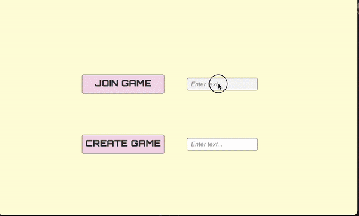

<!---big title--->
# MultiplayerFightingGame
<!---smaller title: make different sections--->
## About the project
Welcome! 😁
This is a server-based multiplayer 2D combat game. Up to 2 players can play in a lobby until one's health reaches zero, as shown below:

    

The objective of this project was to explore game development, and acquire experience working with a server. Moreover, we aimed to create a fun game that reminisces the superpowers we imagined we had when playing as kids 💪🦹 (in fact, the background of the game was inspired by our childhood playground).

As there are improvements to be made to the game, the project is still in development. 

## Tasks of the project:
* [x] Setting up Menu and lobbies (with the server)
* [x] Character Movement
* [x] Attack and Healthbar
* [x] Win and Defeat Screen
* [ ] Fixing lag
* [ ] Adding Characters + Character-Select Menu
* [ ] Adding Attack-moves
* [ ] Improving Aesthetics
* [ ] Adding Animations

## Built using:
* C# programming language
* Unity Engine
* Photon Engine

## References:
<!---italics and bold--->
Part of the code used in this project was taken from [**diving_squid**](https://youtu.be/nmPukdOsYQA "diving_squid's playlist")'s videos. 

## Creators of the project

| Name           | Github   |
| -------------- | ---------|
| Steven Kim     | zteben   |
| Parsa Langari  | PLangari |
